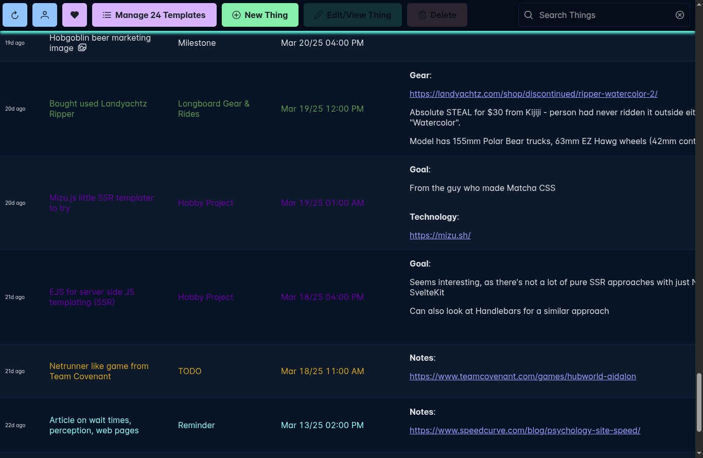
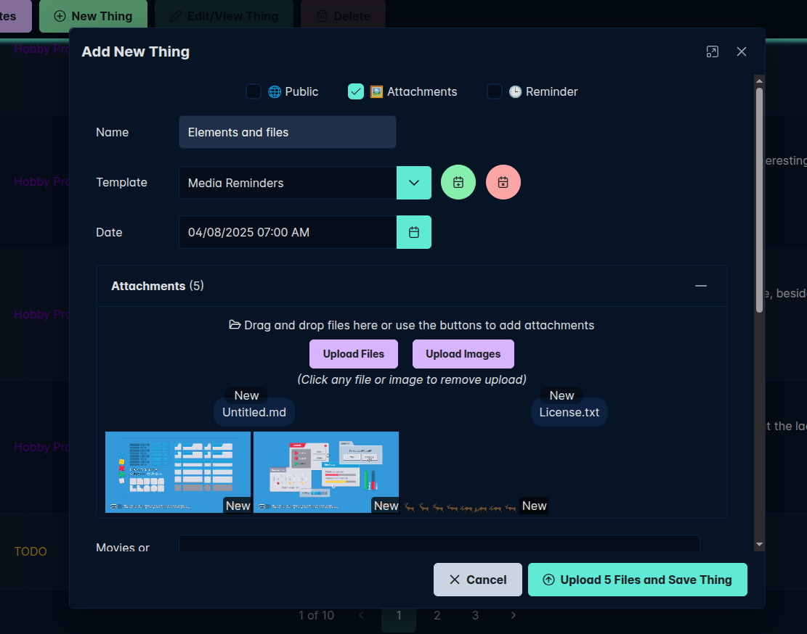
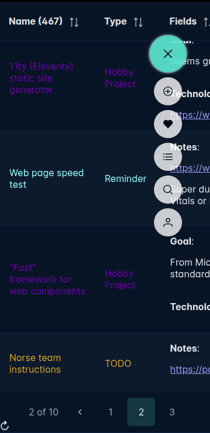

# Remember It Wholesale

A handy way to organize points of interest and pieces of data in your life

You can create different Templates (for whatever you want, like Birthday, Dinner, Boardgame Night, Commute, Allergies, etc.) with a set of customizable and arbitrary fields.

Then you can create Things from those Templates, for specific instances of each event in time. They can also be set as a reminder, or public to generate a link (with an optional expiry) you can share to friends. The public pages use plain HTML and lightweight Alpine.js for super fast load times.

There is also a file sharing piece, as you can attach multiple files or images to a Thing, so great for transferring between computers or people.

Data is fully searchable with table-level filters and a global search.

The app looks great on mobile too and is very easy to access and make quick notes while on the go.

There's more features planned, see `TODO.md` for details.

### Setup and Running

For simplicity and future proofing for my own deployment, no database is used, just flat JSON files in `~/.rememberitwholesale/`

New accounts are requested manually via email, see `config/default.json` for setup of Mailjet

- Uses Angular with PrimeNG components
- Use Node v20+
- See `npm run` for options, but:
  - `npm run backend`: Start up the Node instance to back the app
  - `npm run (dev|prod)`: Run the Angular app locally for development or prod
